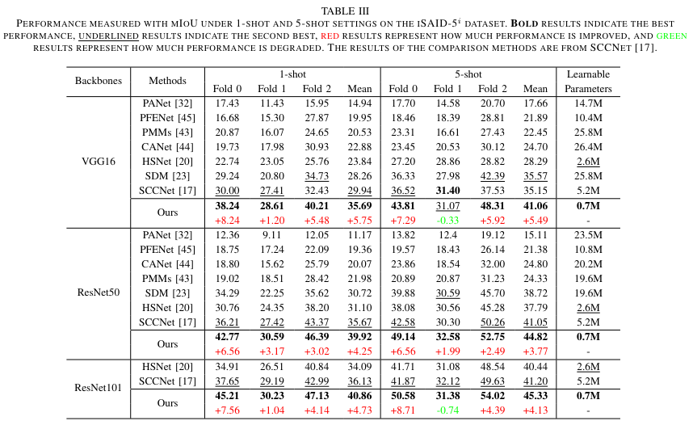

# The code of MGCL

Mask-Guided Correlation Learning for Few-Shot Segmentation in Remote Sensing Imagery (IEEE Transactions on Geoscience and Remote Sensing)


## Abstract

Few-shot segmentation aims to segment specific objects in a query image based on a few densely annotated images, and has been extensively studied in recent years. In remote sensing, image segmentation faces challenges such as less training data, large intra-class diversity, and low foreground-background contrast. In this work, we propose a novel few-shot segmentation method in remote sensing imagery based on Mask-Guided Correlation Learning (MGCL) to alleviate the above challenges. In our MGCL, a novel Mask-Guided Feature Enhancement (MGFE) module is proposed, which makes features have intra-mask consistency by leveraging over-segmented masks. In order to enhance the contrast between foreground and background, a novel Foreground-Background Correlation (FBC) module is proposed, which enhances background correlation representation by learning foreground correlation and background correlation separately. Furthermore, a novel Mask-Guided Correlation Decoder (MGCD) module is proposed to guide the decoder to focus on the consistency within the mask, thereby learning how to segment complete objects and improving segmentation accuracy. Sufficient experiments on the iSAID-5 i and DLRSD-5 i datasets show that our MGCL outperforms all comparative methods. In particular, in the 1-shot setting of the iSAID-5 i dataset, we achieve an mIoU of 39.92 based on ResNet50, which is an improvement of 4.25 over the state-of-the-art method. The visualization of features before and after the MGFE module further concretely demonstrates the motivation and advantages of our MGCL. 


## Methods


## Runner Steps

1. download [SAM weights](https://dl.fbaipublicfiles.com/segment_anything/sam_vit_h_4b8939.pth) and [Datasets](https://drive.google.com/file/d/1ZjlsK6Lob_MwEpSFhxo0bgP5HptS-lND/view)

2. config paths of SAM weights and Datasets

5. just run `main_0_extract_masks.py` for masks.

4. just run `main_1_mgcl_train.py` for training.

5. just run `main_2_mgcl_test.py` for test.


## Results




## Conclusion

In this work, we propose a novel mask-guided correlation learning method for few-shot segmentation in remote sensing imagery. Particularly, by using over-segmented masks to guide how to enhance features, the MGFE module makes the enhanced features have the consistency of features within the mask. Then, by learning foreground correlation and background correlation separately, the FBC module enhances the representation of background correlation and reduces the impact of low foreground-background contrast in remote sensing images. Furthermore, in the decoding of correlation learning, the MGCD module guides the decoder to pay attention to the consistency within the mask and learn how to segment complete objects, thereby improving the accuracy of segmentation. Overall, our proposed method achieves the best segmentation results on two common datasets and establishes a large performance gap with previous methods. The visualization of features before and after the MGFE module further concretely demonstrates the motivation and advantages of our proposed method. In the future, we will explore how to better utilize over-segmented masks.


## BibTex

```
@ARTICLE{10568973,
  author={Li, Shuo and Liu, Fang and Jiao, Licheng and Liu, Xu and Chen, Puhua and Li, Lingling},
  journal={IEEE Transactions on Geoscience and Remote Sensing}, 
  title={Mask-Guided Correlation Learning for Few-Shot Segmentation in Remote Sensing Imagery}, 
  year={2024},
  volume={},
  number={},
  pages={1-1},
  doi={10.1109/TGRS.2024.3417965}
}
```
